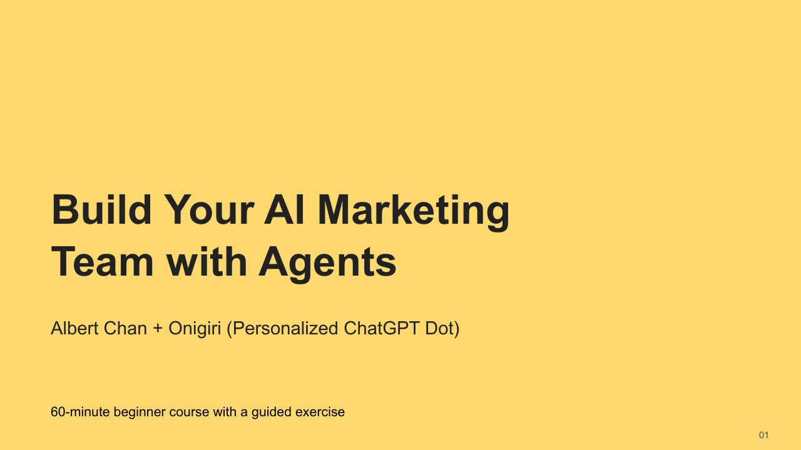
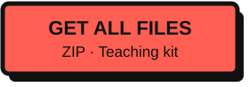

# Build Your AI Marketing Team with Agents

**A 60-minute beginner course with a guided exercise.** Build a fictional Copper Cup Coffee campaign using ChatGPT Work, Onigiri (Personalized ChatGPT Dot), Codex, reusable skills, and specialist agents.

## Download your course materials

  
  
  

| Start with this | Use it for |
| --- | --- |
| **[Download the complete learner workbook](https://github.com/albert-rowland/AI-in-Marketing/raw/refs/heads/main/downloads/learner-workbook.pdf)** | Follow the lessons, copy every prompt, review the sample data, and complete your exercise. |
| **[Download the presentation PDF](https://github.com/albert-rowland/AI-in-Marketing/raw/refs/heads/main/downloads/course-deck.pdf)** | Review the comic-themed slides and marked demo recording slots. |
| **[Download the teaching kit](https://github.com/albert-rowland/AI-in-Marketing/raw/refs/heads/main/downloads/teaching-kit.zip)** | Open the project files, reusable skills, agent roles, sample artwork, and prepared campaign examples. |

> **First visit?** Download the workbook, then open [Start here](START-HERE.md). You can follow this course without using Git commands.

## Your lesson path

| Lesson | Create or learn | Open the guide |
| --- | --- | --- |
| 🟡 **01 · Set up your team** | Give the project context and define Onigiri's responsibility. | [Start lesson 1](lessons/01-set-up-your-team.md) |
| 💥 **02 · Create ads and a website** | Use reusable skills to prepare a Discovery Box campaign. | [Start lesson 2](lessons/02-create-ads-and-a-website.md) |
| 🧠 **03 · Add a Growth Strategist** | Delegate a strategy decision using supplied campaign data. | [Start lesson 3](lessons/03-add-a-growth-strategist.md) |
| 📣 **04 · Prepare social content** | Coordinate six posts and prepare a calendar for review. | [Start lesson 4](lessons/04-prepare-social-content.md) |
| 🤝 **05 · Run a coordinated campaign** | Give specialists separate tasks and review their combined outputs. | [Start lesson 5](lessons/05-run-a-coordinated-campaign.md) |
| ✅ **06 · Practice and review** | Complete the ten-minute exercise and plan your next campaign. | [Start lesson 6](lessons/06-practice-and-review.md) |

## Choose your route

**Learner route.** Follow the workbook or the six linked lesson guides. Each prompt explains where to paste it, which files to provide, the output to expect, and the check to complete before continuing.

**Instructor route.** Open [the editable Google Slides deck](https://docs.google.com/presentation/d/1EY7U2ZDfHXPUsubG0SyrNJdkPEbLEOhQGgygsC7SWC0/edit) using the instructor account. Use its speaker notes or [the complete instructor notes](docs/instructor-notes.md) for the teaching script, complete prompts, and demo recording checklists. Replace each marked recording slot with your own capture. [Open the recording guide](recordings/README.md) and [review the deck outline](docs/deck-outline.md).

**Files route.** Open [the course project](course-files/README.md) if you want the editable sources. Hidden `.agents` and `.codex` folders contain supplied definitions, so use the ZIP download when your file browser hides those folders.

## The campaign you will build

Copper Cup Coffee sells a fictional Discovery Box containing three 100 g coffee bags. The example price is USD 29, with USD 5 shipping. Supplied data supports classroom comparisons. Future campaign results require separate validation.

Prepared examples include [three ad concepts](course-files/campaigns/discovery-box/rehearsal/ads/concepts.md), [a campaign strategy](course-files/campaigns/discovery-box/rehearsal/strategy/strategy.md), [six social post packages](course-files/campaigns/discovery-box/rehearsal/social/), and [a ten-page brewing guide](course-files/campaigns/lead-magnet/rehearsal/brewing-guide.pdf).

## Account requirements and review

Check [the account and connection checklist](course-files/setup-checklist.md) before beginning. The full demonstration uses Work, a visible Dot, local project access, image generation, Slack, Notion, and Sites. Feature availability depends on your account, region, app, and connections. Learners can observe unavailable features and complete the supplied ad exercise with an available project chat.

Keep the classroom outputs as drafts and local previews. Review any proposed scheduling, sending, deployment, lead collection, or spending before authorizing that action. The supplied download form validates an example address and opens a PDF, with production storage and email delivery outside the demonstration.

## Credits and updates

The teaching order adapts [Grace Leung's original tutorial](https://www.youtube.com/watch?v=BzS93V2zFTg). This course uses a fictional coffee company, new artwork, comic styling, and supplied practice data. [Read the sources and adaptation notes](course-files/sources.md).

Course materials were prepared on October 4, 2026. Refresh account requirements and product instructions before teaching another session.
